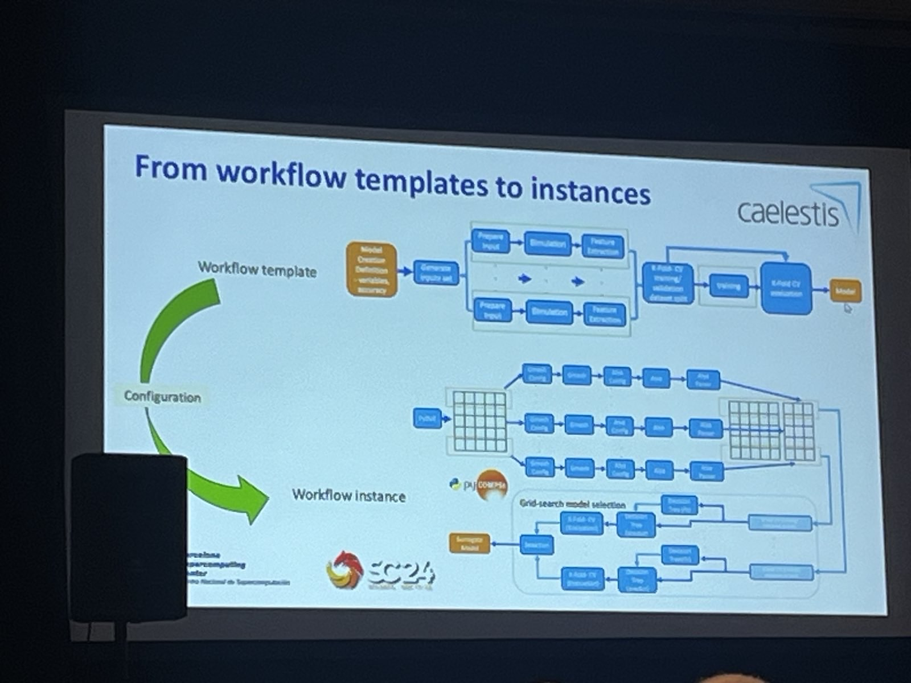

## Can Python Do for HPC What It Did for Machine Learning?

- -https://sc24.conference-program.com/presentation/?id=bof213&sess=sess633

### Description

`Python is now one of the most popular programming languages. In HPC, it has predominantly been used to coordinate coarse-grain library components or workflows. However, it is increasingly being used to develop and coordinate applications with dynamic finer-grain components that are challenging to map efficiently onto heterogeneous resources. In this BoF, we discuss this challenge and efforts to design Python-based HPC, production quality codes for HPC leadership platforms. We will discuss issues such as multithreading, GPU kernel development, task-based coordination on heterogeneous systems with a mix of CPUs and GPUs, inter-node interoperability, scalability, portability, and reproducibility.`

### Notes

- - Parla: HPC tasks for shared-memory heterpgeneous npodes in Python
- - MPI + X where X = `parla`
- - [parla.py](https://github.com/ut-parla/Parla.py)
- - There are namespaces in parla
- - uses containerizations
- - PArrays and CrossPy
- - CrossPY [getting started guide](https://users.oden.utexas.edu/~byou/crosspy/user/start/quickstart.html)

###

- - computational workkflows in PyCOMPS
- - [pypi page for PyCOMPSS](https://pypi.org/project/pycompss/)
- - [PyCOMPSS documentation](https://compss-doc.readthedocs.io/en/stable/)
- - can work with PyMPI

- -

### PyKokkos: a performance framework

- - [Pykokkos on GitHub](https://github.com/kokkos/pykokkos)
- - writing with Pykokkos is easier for folks with C++ experience
- - works for CPU and GGPU contexts

### distributed tasking in Python with Legion

- - pygion; pytorch; numba;
- - all about the distrubuted python tasking

### cuPyNumeric: zero code

#### [NVIDIA cuPyNumeric](https://developer.nvidia.com/cupynumeric)

`NVIDIA cuPyNumeric aspires to be a drop-in replacement library for NumPy, bringing distributed and accelerated computing on the NVIDIA platform to the Python community. It allows researchers and scientists to write their research programs productively using native Python language and familiar tools without having to worry about parallel computing or distributed computing. cuPyNumeric and Legate can then easily scale their programs from single-CPU computers to MGMN supercomputers, without changing the code.`

[NVIDIA accelerated-computing-hub on GutHub](https://github.com/NVIDIA/accelerated-computing-hub)

[some python for HPC](https://github.com/dionhaefner/pyhpc-benchmarks)
